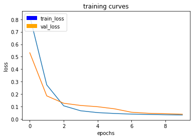

# Write Up

## Project Steps

In the "Follow Me" project the student needs to understand several layers of topics including:

* Image Preprocessing
* Building a fully convolutional network for semantic segmentation
* Optimizing the use of hyper parameters for that network
* Collecting additional trainings (and validation) data to further increase the accuracy of the network

to do a semantic segmenation of image inputs. This segmentation is used to distinguish between a hero target, non-targeting bystanders and the background. The hero is marked as blue, the bystanders are green and the background is red. This RGB scheme is helpful to increase the distance between the labels.

The goal of this exercise is to train a neural network to successfully follow the hero-target with a drone based on the drones camera input.

#### Image Preprocessing

The image preprocessing is mainly handled by predefined python scripts provided by udacity. The script acts on the output of the simulator data and creates a mask with the segmentation labels included. The image size is fairly small (256 x 256) which is even further downsampled for the neural network to (160x160) to increase the processing / training speed. The downside is less useable information contained by the input. 

The image preprocessing practiced in this project is fairly difficult to replicate in a real world scenario. Because of the simulation the preprocessing script knows where to find the to be labeled data and creates the appropriate mask. Setting the correct labels in real world images requires immensive effort to label the data manually. 

## Network Architecture


### Fully Convolutional Network

The Fully convolutional network, which is represented by the above displayed architecture used in this project, is the current "go to architecture" for image segmentation as it preserves spatial information throughout the network. It is normally comprised of encoder, 1x1 convolutional and decoder layers which will be explained in detail below.

The first network architecture to reach more than 40% accuracy consisted of three encoder, one 1x1 convolutional and three decoder layers. The previous tested networks had 1 and 2 encoder / decoder layers and did only achieve nearly 33 % as a maximum accuracy. The following parts will explain each kind of layer of the chosen network.

### Encoder Layer

Convolutional layers emerged in the recent years as the "to be used" layer for image recognition and classification. Each convolutional layer helps to find certain features in an image which then are used in the following layers. They basically composite the image based on smaller features. In an exemplary case the first layer searches for simple figures like lines, circles, rectangles or chessboard patterns. The next layer will then look for more advanced patterns based on those findings or the previous layer. Examples are eyes, noses or mouths in case of a human being present in an image.

Because of the way this layer applies the kernel the to be trained parameters can be quite high (see 

[Udacity Lab: Encoder]: https://classroom.udacity.com/nanodegrees/nd209/parts/c199593e-1e9a-4830-8e29-2c86f70f489e/modules/cac27683-d5f4-40b4-82ce-d708de8f5373/lessons/99db3ae7-9e87-40ba-b83c-5d1428643d2d/concepts/6931809d-7674-49c8-8536-093fd7ca1788

) which might lead easily overfittable network. Especially in our case where the trainings data we use is not high in numbers it is crucial to work with a "as simple as possible" network architecture. Therefore Udacity introduced the separable convolutional layer to us. 

The **Encoder Layer** is handling to find certain features in an image while using the separable convolutional layer and batch normalization.

##### Separable Convolutional Layer

The difference to a normal convolution layer is simple: Instead of letting the kernel include all channels of an image (in this case the RGB channels) and therefore increase the number of parameters necessary to represent the convolution, we have a kernel running over each channel separately and then combine the outputs with a 1x1 convolution. This reduces the parameter for an input shape of 32x32x3 from 243 (normal convolution) to 54. 

##### Batch Normalization

Addtionally we worked with the so called Batch normalisation. Usually, the input of a network is normalized to increase the speed of training and to reduce the chance to stuck in a local optima. It further helps to when the input features of the network differ greatly in their range and scale. Because we linearly combine features in a network features with x-magnitude higher than others might dominate them purely through their numbers. This can be prevented with normalization.

In batch normalization this concept is applied to every layer of a neural network. You could imagine the layer as its own neural network with normalized inputs. According to Udacity it provides several benefits including training the network faster, allowing higher learning rates and most notably providing a bit of regularization by adding noise to the system.

### Decoder Layer

The decoder layer transform the encoded features back to the original image size (and adding the additional segmenation layers) layer by layer. To do so it utilizes three different concepts: Bilinear Upsampling, Batch Normalization and skipping connections. Batch normalization has been explained already. The layer is built on the bilinear upsampling layer, a convolutional layer and the skip connections layer.

##### Bilinear Upsampling

With every encoding layer the size of the output is reduced and we move away from the original image size. Our goal with the fully convolutional network is to get a segmented output image of the same shape as the input image. To achieve this the bilinear upsampling layer uses a simple trick to resample the input by creating a new pixel based on the weighted average of the four nearest known pixels. This method is part of the interpolation toolset. By just following the rules this layer can not be trained. 

##### Skip Connections

Through the convolutional process of the encoder layers we loose spatial information which is usefull to recover the full image for the output. By connecting each encoder layer with its decoder layer counterpart we can reduce the lost of spatial information.

### 1x1 Convolution

The 1x1 convolutional layer is the connecting layer between the encoder and decoder section. It can be seen as an efficient and quick feature dimensionality reduction filter. It does not adjust the width and height of the last output (most commonly of a prior convolutional layer) but its depth. For example let the last encoder layer distinguish between several objects (humans, animal, trees and other shapes) the 1x1 convolutional might simply reduce (therefore prune) or combine those features further without reducing the spatial information.

## Parameter Tuning 

```python
number_of_images = 5500

learning_rate = 0.001
batch_size = 16
num_epochs = 50
steps_per_epoch = int(np.ceil(number_of_images / batch_size))
validation_steps = 100
workers = 2
```

##### Number of Images

The number of images is depending on the provided trainings data. It is equal to the number of images from the original data set (provided by Udacity) and my own collected trainings data.

##### Learning Rate

The learning rate is set to the standard rate of the adam optimizer.

##### Batch Size

The Batch size was tested in a trial and error attempt. The maximum possible batch found for the AWS machine has been a batch of 100. As i read in the slack channel about the attempt of using different batch size i tested with 8 / 16 / 32 / 64 / 100 and have chosen the one working best. the following images show the results of

**16**


**32**


**64**



Where you can see that 16 starts way lower than the others and finishes with a better accuracy as well. In the present case 16 completed with 44% while the others ranged between 34-37% accuracy.

##### Epochs

The number of epochs is based on one of my first experiments with the following training curve:


It showed that the model is still improving both the trainings and validation metrics until the 40ths epoch. For this i set the arbitrary boundary for my further experiments to 50 epochs which seemed suitable to reach the 40% accuracy.

##### Steps per Epoch

The steps are simply calculated based on the number of images and the batch size. The goal is to include all images in the training in one epoch.

##### Validation Steps

I caught the number of 200 in the udacity slack channel and stayed with it. Testing around with it was not really necessary.

## What worked well and what not

I had a couple of problems collecting new trainings data. This was first based on a script error when processing the collected images. This led to not correctly looking label images. Secondly i realised to late that i can use the follow-me mode to collect data directly with the target.

I further had some issues with getting the allowance to use the AWS instance because it was a new AWS account. AWS obviously doesn't like that. I then used our company AWS playground instead.

After solving my trainings data collecting issues i could easily work on improving specific metrics like the accuracy for following the target. In my opinion this is the most important scenario as the drone should here as reliable as possible.

As this project is mostly about a lot of simulation and trial and error everything worked as expected. I was able to use some of my knowledge from the previous self driving car project. My difficulties were lying more on the infrastructure / hardware / setup side. 

One of the important key points of this project is whether we can apply this model for scenarios other than following humans. The model itself will only work on the recorded / trained scenario but we can utilize the parameters and the network to easily train a new model with new trainings data to follow an animal for example. It might also be possible to use transfer learning - i assume that removing / replacing the last encoder layer and then retrain on a smaller training set with the new scenario might improve the accuracy and training speeds.

## Future Enhancements

In further enhancements i would concentrate on two points:

* Collecting more trainings data

* Improvements of the network architecture

One of the most important tasks in data science to have actual data. The provided data by udacity might be enough for this project but to further improve the model and make it more robust and reliable, my first guess is to further collect trainings data.

Secondly there are several methods to speed up the network training and to improve regularisation through network improvements. The most common ones are the dropout and pooling layers. I would suggest to test those layers.